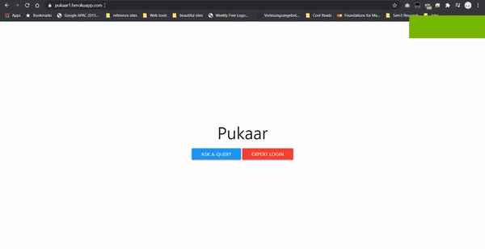
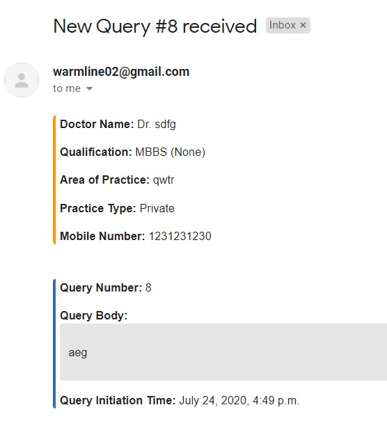
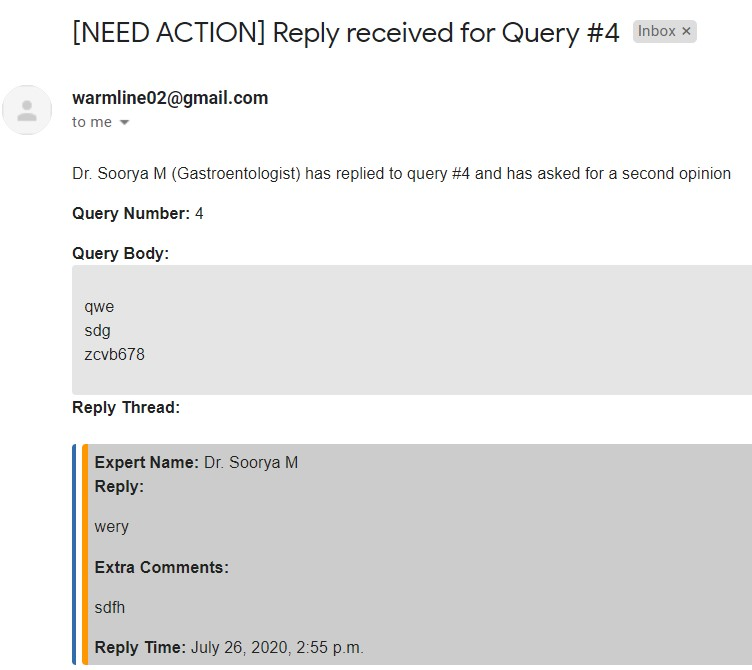

# [Pukaar](https://pukaar1.herokuapp.com)

Pukaar aims to connect local doctors with specialists across India for rapid response and communication. When general practitioners are unable to diagnose a patient's problem due to it being outside their field of expertise or if they require an opinion from a more experienced doctor, this tool acts as a medium to get the queries answered by specialists so that timely diagnosis can be done. During the time of emergencies such as Covid 19, a web based tool which is easily accessible, can help in connecting doctors to give proper diagnosis for people.

## Instructions
### For General Users:
1. Ask a query by filling out the form
2. User will get a confirmation email on the email provided by him/her in the query form
3. User will get a notification through email when the query has a reply along with a option to mark the reply satisfactory or not. If marked satisfactory, query will be closed, if not, the query will be forwarded to another specialist
4. Call number, follow the instructions of the phone assistant and say the query in the following format when prompted: "Name, Dr. Rakesh Sharma. Practice Type, Public/Private. Area of practice: Noida. Query: Patient has pain in stomach..."*
*Note: The service being used to serve a toll free number is **Knowlarity**, they only offer a 7 day trial. The trial service has expired but it can be activated again after payment (monthly/yearly)*

### For Specialists/Experts
*Note: Only users who have been set as "Expert" by admins can login into the portal*
1. Expert has to login using his/her gmail account OR the provided gmail account (if expert doesn't have one or doesn't want to use his/her gmail account)
2. After logging in, all the queries specific to the expert can be viewed and replied to.
3. Expert can reply to queries in the *"Reply field"* and also fill out *"Extra field"* if he/she wants the query to be forwarded to another expert

### For Pukaar Admins

*Note 1: Email addresses will be provided to Admins as well. After logging in, admin page will be shown. This page will only be accessible by the admins, but for demonstration it has no login requirements*

*Note 2: Whenever there is a new query or if a query is answered, there is an email notification for the admins. The emails will be received once the admin emails are set up*

Open admin page by opening:
https://pukaar1.herokuapp.com/setExpertView
1. Set or unset  users as "Experts" in "Create/Assign specialty to experts" tab. (Can only be done for users who have logged in once using the login button)
2. Create Specialty group (Cardiologist, etc) in Django admin page's "Group" section.
*Admin url:* *https://pukaar1.herokuapp.com/admin
username: pukaar_admin
password: Qwer!234*

3. "Expert not assigned" tab contains queries which are new as well as queries which an expert has suggested to take a second opinion from another expert. For each query, choose an expert and press "Send email" to send an email notification to the selected expert. Queries can also be searched by their Number (#1 or #12, etc)

**New Query Email Notification:**

**New 'Expert needs to be assigned' Email notification:**

4. "Expert assigned (needs reply)" tab contains queries which have been forwarded to experts but haven't yet been resolved. By pressing "Send email" button, a reminder can be sent to the chosen expert if a reply hasn't been given for some days.
5. "Expert assigned (reply given)" tab contains queries which have received replies and have been marked satisfactory (marked by query initiator to denote the reply as satisfactory)

